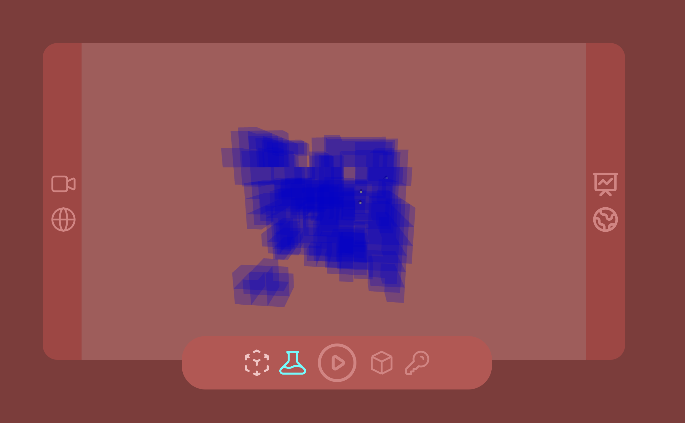

# 🐜 Ant Colony Simulation

## Application

This project is a **web-based ant colony simulation** built with **React**, **TypeScript**, and **@react-three/fiber** for 3D rendering. The goal of the simulation is to mimic how ants explore their environment, discover food, and carry it back to the anthill using pheromone trails.

Ants operate in a dynamically generated terrain where they autonomously navigate, communicate through pheromones, and adapt based on their environment. The application is fully interactive and offers real-time visual feedback of the ants' behavior.

---

## Pheromones

Ants rely on two main types of pheromones to navigate:

1. **Exploratory Pheromone** – left behind when the ant is **searching for food**.

2. **Return Pheromone** – released when the ant is **carrying food back to the anthill**.

Upon finding food or returning home, ants **switch the type of pheromone** they leave. Other ants sense these pheromones and adjust their movement probability accordingly, increasing the chance of locating resources efficiently.

You can visualize **pheromone concentrations live** during the simulation and explore their distribution using the **chart icon**.

---

## Terrain

The terrain is procedurally generated using **Perlin noise**, simulating a **cave-like structure** within a cubic grid. Each cell is classified as either walkable or blocked, affecting how ants move through the environment.

You can inspect:

- **Walkable terrain**  
- **Available tunnels and paths**  
- **Food spawn points**  
- **The anthill (single starting point)**

using the **bottom menu** options.

---

## Database

The simulation is backed by a **custom-built database**. Every step in the simulation is reflected in database updates:

- Anthill and terrain generation
- Ant movements
- Pheromone tracking
- Food collection

This ensures persistent, queryable state and allows for **deeper analysis and visualization** of the ants’ behavior over time.

## 🧠 Tech Stack

  

- **@react-three/fiber** for 3D rendering
- **Custom Terrain Generation** with Perlin Noise
- **Ant Colony Algorithm**

---
